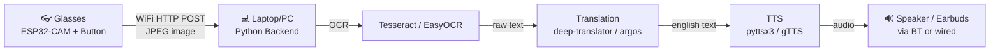
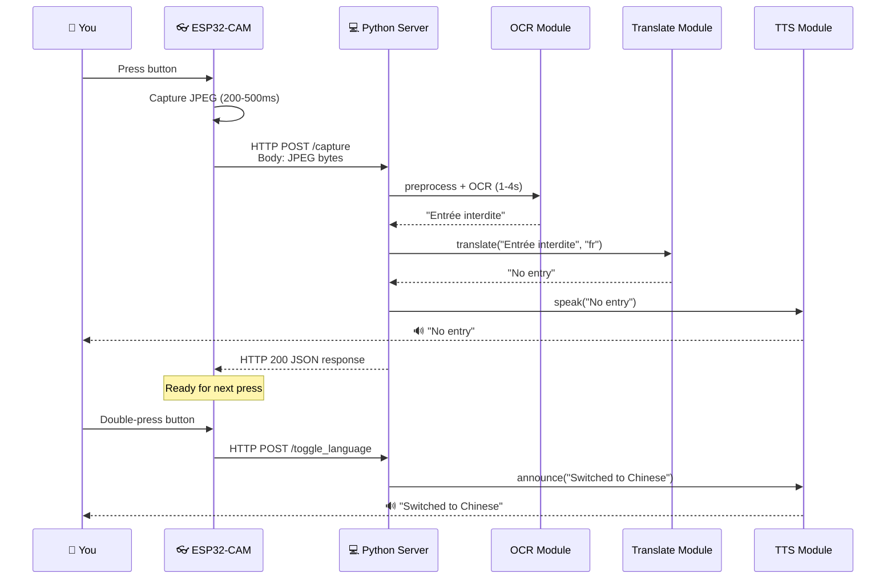

# Smart Translation Glasses — Functional Prototype Guide

> ESP32 + Camera → WiFi → Python Backend (OCR → Translation → TTS) → Audio out

---

## 1. System Architecture Overview



### What talks to what

| From | To | How | What's sent |
|---|---|---|---|
| Button press | ESP32 | GPIO interrupt | "take photo now" signal |
| ESP32-CAM | Python server | HTTP POST over WiFi | JPEG bytes (~10-40KB) |
| Python OCR | Translation module | Function call | Extracted text string |
| Translation | TTS | Function call | English text string |
| TTS | Speaker | Local audio playback | WAV/MP3 audio |

---

## 2. Hardware You Need

### Bill of Materials

| Part | Model | Why this one | Approx Cost |
|---|---|---|---|
| Microcontroller + Camera | **ESP32-CAM (AI-Thinker)** | Built-in OV2640 camera, WiFi, tiny | ~$7 |
| USB Programmer | **FTDI FT232RL** or **ESP32-CAM-MB** dock | ESP32-CAM has no USB port | ~$3-5 |
| Button | Any **momentary tactile push button** | Simple, reliable | ~$0.50 |
| Power | **3.7V LiPo battery (500-1000mAh)** + **TP4056 charger** | Portable power | ~$5 |
| Audio output | **Bluetooth earbuds** or **wired 3.5mm earbuds** | Hear translations | You have these |
| Glasses frame | Any **thick-framed glasses** or 3D-printed mount | Mount everything | ~$5 |
| Wires/misc | Jumper wires, hot glue, shrink tubing | Assembly | ~$3 |

### Wiring Diagram

```
ESP32-CAM (AI-Thinker) Pin Layout:
┌─────────────────────────────┐
│                             │
│   [OV2640 Camera Module]    │
│         (top side)          │
│                             │
├─────────────────────────────┤
│                             │
│  GPIO 0  ── Button ── GND  │  ← The capture button
│                             │
│  5V  ─── Battery VCC       │
│  GND ─── Battery GND       │
│                             │
│  GPIO 4 = onboard flash LED│  ← (optional, can blind you, disable it)
│                             │
│  U0T (TX) ── FTDI RX       │  ← For programming only
│  U0R (RX) ── FTDI TX       │  ← For programming only
│                             │
└─────────────────────────────┘
```

> [!WARNING]
> **GPIO 0 dual purpose**: GPIO 0 is also the boot mode pin. It must be HIGH during normal boot and LOW during flashing. Your button pulls it LOW, so **hold the button WHILE powering on = flash mode**. During normal operation, use `INPUT_PULLUP` so it stays HIGH and only goes LOW on press. This is fine but you need to know it.

> [!CAUTION]
> **DO NOT use GPIO 4 for the button** — it controls the blinding white flash LED. If you accidentally trigger it while wearing the glasses, you'll blind yourself momentarily.

---

## 3. ESP32-CAM Firmware (Arduino)

Flash this via Arduino IDE with the **ESP32 board package** installed.

### What the firmware does:
1. Connects to your WiFi
2. Waits for button press on GPIO 0
3. Takes a photo with the camera
4. Sends it via HTTP POST to your Python server
5. Waits for next button press

### Key settings in firmware:

```
// ---- THINGS YOU MUST CHANGE ----
WiFi SSID:        "YourWiFiName"
WiFi Password:    "YourWiFiPassword"
Server URL:       "http://192.168.1.XXX:5000/capture"
                   ↑ Your laptop's local IP

// ---- CAMERA SETTINGS THAT MATTER ----
Frame size:       FRAMESIZE_VGA (640x480) — good balance
                  FRAMESIZE_SVGA (800x600) — better OCR, slower
                  FRAMESIZE_XGA (1024x768) — best OCR, slowest

JPEG Quality:     10-15 (lower = better quality, bigger file)
                  Don't go below 10, ESP32 will crash

// ---- BUTTON ----
Button GPIO:      GPIO 0
Debounce time:    200ms (prevents double-triggers)
```

### Flashing process:
1. Connect FTDI to ESP32-CAM (TX→RX, RX→TX, 5V→5V, GND→GND)
2. Connect GPIO 0 to GND (or hold button while powering on)
3. In Arduino IDE: Board = "AI Thinker ESP32-CAM", Port = your COM port
4. Upload
5. **Disconnect GPIO 0 from GND** (or release button)
6. Press RST button on ESP32-CAM

> [!IMPORTANT]
> **The #1 problem people hit**: Upload fails with "Failed to connect to ESP32". This means GPIO 0 isn't LOW during boot. Hold the button (or bridge GPIO 0 to GND), then press RST, THEN click upload.

---

## 4. Python Backend — Module Breakdown

You said you're making separate `.py` files. Here's how to structure them:

```
translation_glasses/
├── server.py           ← Flask server, receives images from ESP32
├── ocr_module.py       ← OCR processing
├── translate_module.py ← Translation (FR/ZH → EN)
├── tts_module.py       ← Text-to-Speech playback
├── config.py           ← All settings in one place
├── language_state.py   ← Language switching logic
└── requirements.txt
```

---

### 4.1 `config.py` — Central Configuration

This is where EVERYTHING configurable lives. When you're debugging at 2am, you'll thank yourself.

```python
# config.py

# Server
SERVER_HOST = "0.0.0.0"     # Listen on all interfaces
SERVER_PORT = 5000

# OCR Engine choice: "tesseract" or "easyocr"
OCR_ENGINE = "easyocr"

# Tesseract path (Windows)
TESSERACT_PATH = r"C:\Program Files\Tesseract-OCR\tesseract.exe"

# Supported languages
LANGUAGES = {
    "french":  {"ocr_code": "fra",        "translate_code": "fr", "label": "French"},
    "chinese": {"ocr_code": "chi_sim",    "translate_code": "zh-CN", "label": "Chinese"},
}

# Default active language
DEFAULT_LANGUAGE = "french"

# TTS
TTS_ENGINE = "pyttsx3"       # "pyttsx3" (offline) or "gtts" (online, better quality)
TTS_SPEED = 150               # Words per minute for pyttsx3

# Image preprocessing
PREPROCESS_IMAGE = True       # Apply contrast/threshold before OCR
```

---

### 4.2 `language_state.py` — Language Switching

#### How switching works in practice:

**Option A — Double-press the button** (recommended for prototype):
- Single press = capture & translate
- Double press (two presses within 500ms) = toggle language
- ESP32 detects this and sends a different HTTP endpoint

**Option B — Long press**:
- Short press (<1s) = capture
- Long press (>2s) = toggle language

**Option C — Second button** (simplest, most reliable):
- Button 1 on GPIO 0 = capture
- Button 2 on GPIO 12 = toggle language

```python
# language_state.py

from config import LANGUAGES, DEFAULT_LANGUAGE

class LanguageState:
    def __init__(self):
        self._languages = list(LANGUAGES.keys())  # ["french", "chinese"]
        self._current_index = self._languages.index(DEFAULT_LANGUAGE)

    @property
    def current(self):
        return self._languages[self._current_index]

    @property
    def ocr_code(self):
        return LANGUAGES[self.current]["ocr_code"]

    @property
    def translate_code(self):
        return LANGUAGES[self.current]["translate_code"]

    def toggle(self):
        self._current_index = (self._current_index + 1) % len(self._languages)
        new_lang = LANGUAGES[self.current]["label"]
        return new_lang  # Return name so TTS can announce it

# Single global instance
lang_state = LanguageState()
```

When you toggle, **have TTS announce it**: *"Switched to Chinese"* — otherwise you'll never know what mode you're in.

---

### 4.3 `ocr_module.py` — Text Recognition

#### Tesseract vs EasyOCR — Real Talk

| | Tesseract | EasyOCR |
|---|---|---|
| Speed | Fast (~0.5-1s) | Slow (~2-5s, first run ~15s loading model) |
| French accuracy | Good | Good |
| Chinese accuracy | **Mediocre** | **Much better** |
| Install pain | Medium (separate install) | Easy (pip install) |
| GPU support | No | Yes (CUDA) |
| **Recommendation** | Fine for French | **Use this for Chinese** |

> [!IMPORTANT]
> **For Chinese OCR, use EasyOCR.** Tesseract's Chinese models are significantly worse on real-world images (signs, menus, etc). This is non-negotiable if you want usable results.

#### Image preprocessing — THE thing that makes or breaks OCR

Raw camera images from ESP32-CAM are often:
- Blurry (cheap lens, no autofocus)
- Low contrast (bad lighting)
- Tilted (you're wearing glasses, not holding a phone steady)

**You MUST preprocess.** Here's what actually helps:

```python
# ocr_module.py — preprocessing pipeline

import cv2
import numpy as np

def preprocess_for_ocr(image_bytes):
    """Convert raw JPEG bytes to OCR-ready image."""
    # Decode JPEG
    nparr = np.frombuffer(image_bytes, np.uint8)
    img = cv2.imdecode(nparr, cv2.IMREAD_COLOR)

    # 1. Convert to grayscale
    gray = cv2.cvtColor(img, cv2.COLOR_BGR2GRAY)

    # 2. Resize UP — OCR works better on larger images
    #    ESP32-CAM at VGA (640x480) is small for OCR
    height, width = gray.shape
    if width < 1000:
        scale = 1000 / width
        gray = cv2.resize(gray, None, fx=scale, fy=scale,
                          interpolation=cv2.INTER_CUBIC)

    # 3. Denoise (important for ESP32-CAM's noisy sensor)
    gray = cv2.fastNlMeansDenoising(gray, h=10)

    # 4. Adaptive threshold — handles uneven lighting
    #    Use this for printed text (signs, menus, books)
    binary = cv2.adaptiveThreshold(
        gray, 255, cv2.ADAPTIVE_THRESH_GAUSSIAN_C,
        cv2.THRESH_BINARY, 31, 10
    )

    # 5. Optional: deskew (fix tilt from glasses angle)
    # coords = np.column_stack(np.where(binary > 0))
    # angle = cv2.minAreaRect(coords)[-1]
    # ... rotate image by -angle ...

    return binary  # Return preprocessed image
```

#### The OCR function itself:

```python
# Two engine options in the same module:

# --- EasyOCR (recommended) ---
def ocr_easyocr(preprocessed_img, lang_code):
    import easyocr
    # Map codes: EasyOCR uses 'fr', 'ch_sim' (not 'fra', 'chi_sim')
    code_map = {"fra": "fr", "chi_sim": "ch_sim"}
    reader = easyocr.Reader([code_map.get(lang_code, lang_code), 'en'])
    results = reader.readtext(preprocessed_img)
    text = ' '.join([r[1] for r in results])
    return text

# --- Tesseract ---
def ocr_tesseract(preprocessed_img, lang_code):
    import pytesseract
    text = pytesseract.image_to_string(preprocessed_img, lang=lang_code)
    return text.strip()
```

> [!WARNING]
> **EasyOCR model loading takes 10-15 seconds on first call.** Pre-load the Reader at server startup, not on each request. Create it once globally. Otherwise your first translation will take forever and you'll think it's broken.

> [!TIP]
> **Keep the EasyOCR Reader warm for BOTH languages.** Create two readers at startup:
> ```python
> readers = {
>     "french": easyocr.Reader(['fr', 'en']),
>     "chinese": easyocr.Reader(['ch_sim', 'en']),
> }
> ```
> This uses ~1-2GB RAM total. If your machine is tight on RAM, create one and swap as needed (but that costs 10s per swap).

---

### 4.4 `translate_module.py` — Translation

#### Library choices:

| Library | Online? | Quality | Speed | Free? |
|---|---|---|---|---|
| `deep-translator` (Google backend) | Yes | Excellent | ~0.5s | Yes (rate limited) |
| `argostranslate` | **No (offline)** | Good | ~1s | Yes |
| `googletrans` | Yes | Excellent | ~0.3s | **Breaks constantly** |

**Recommendation**: Use `deep-translator` with Google backend. If you need offline, use `argostranslate` but you must download language packs first.

```python
# translate_module.py

from deep_translator import GoogleTranslator

def translate_to_english(text, source_lang_code):
    """
    source_lang_code: 'fr' for French, 'zh-CN' for Chinese
    """
    if not text or text.strip() == "":
        return ""

    translator = GoogleTranslator(source=source_lang_code, target='en')
    result = translator.translate(text)
    return result
```

#### Real problems you'll hit:

1. **OCR errors corrupt translation**: OCR might read "Bienvenue" as "Bienverme". The translator will try its best, but garbage in = garbage out. **This is normal.** Better preprocessing → better OCR → better translation.

2. **Mixed text**: A French menu might have "Café Latte" (half French, half Italian). The translator handles this fine.

3. **Chinese OCR returns individual characters with spaces**: EasyOCR sometimes puts spaces between Chinese characters. The translator still works, but clean it up:
   ```python
   if source_lang_code == "zh-CN":
       text = text.replace(" ", "")  # Remove spaces between Chinese chars
   ```

4. **Rate limiting**: Google Translate via `deep-translator` will rate-limit you if you spam it. Not a problem for normal use (one press at a time), but if you're testing rapidly, add a 1-second cooldown.

---

### 4.5 `tts_module.py` — Text-to-Speech

#### Library choices:

| Library | Online? | Voice Quality | Latency |
|---|---|---|---|
| `pyttsx3` | **No (offline)** | Robotic but fine | Instant |
| `gTTS` | Yes (Google) | Natural, good | ~1-2s download |
| `edge-tts` | Yes (Microsoft) | **Best quality** | ~1s |

```python
# tts_module.py

import pyttsx3

# Initialize ONCE at module load, not per-call
engine = pyttsx3.init()
engine.setProperty('rate', 150)    # Speed
engine.setProperty('volume', 1.0)  # Max volume

def speak(text):
    """Speak the translated English text."""
    if not text:
        engine.say("No text detected")
    else:
        engine.say(text)
    engine.runAndWait()

def announce(message):
    """For system messages like 'Switched to Chinese'."""
    engine.say(message)
    engine.runAndWait()
```

> [!WARNING]
> **`pyttsx3` and threading DON'T MIX on Windows.** If you call `speak()` from a Flask request handler (which runs in a thread), it will crash or hang. Solutions:
> 1. **Use a queue**: Put text into a `queue.Queue()`, have a dedicated TTS thread consume it
> 2. **Use `edge-tts` instead**: It's async-friendly and sounds much better
> 3. **Use `gTTS` + `pygame`**: Generate MP3, play with pygame (works in threads)

#### The threading-safe approach:

```python
# tts_module.py — thread-safe version

import threading
import queue
import pyttsx3

_tts_queue = queue.Queue()

def _tts_worker():
    engine = pyttsx3.init()
    engine.setProperty('rate', 150)
    while True:
        text = _tts_queue.get()
        if text is None:
            break
        engine.say(text)
        engine.runAndWait()

# Start the TTS worker thread at import time
_thread = threading.Thread(target=_tts_worker, daemon=True)
_thread.start()

def speak(text):
    _tts_queue.put(text if text else "No text detected")

def announce(message):
    _tts_queue.put(message)
```

---

### 4.6 `server.py` — The Flask Server (Ties Everything Together)

```python
# server.py

from flask import Flask, request, jsonify
from config import SERVER_HOST, SERVER_PORT
from language_state import lang_state
from ocr_module import preprocess_for_ocr, ocr_easyocr
from translate_module import translate_to_english
from tts_module import speak, announce

app = Flask(__name__)

@app.route('/capture', methods=['POST'])
def capture():
    """ESP32 sends JPEG image here."""
    image_bytes = request.data  # Raw JPEG bytes

    if not image_bytes:
        return jsonify({"error": "No image data"}), 400

    # 1. Preprocess
    processed = preprocess_for_ocr(image_bytes)

    # 2. OCR
    raw_text = ocr_easyocr(processed, lang_state.ocr_code)
    print(f"[OCR] Detected ({lang_state.current}): {raw_text}")

    # 3. Translate
    english = translate_to_english(raw_text, lang_state.translate_code)
    print(f"[Translate] English: {english}")

    # 4. Speak
    speak(english)

    return jsonify({
        "original": raw_text,
        "translated": english,
        "language": lang_state.current
    })

@app.route('/toggle_language', methods=['POST'])
def toggle_language():
    """ESP32 sends this on double-press."""
    new_lang = lang_state.toggle()
    announce(f"Switched to {new_lang}")
    print(f"[Language] Now: {new_lang}")
    return jsonify({"language": new_lang})

@app.route('/health', methods=['GET'])
def health():
    """ESP32 can ping this to check server is alive."""
    return jsonify({"status": "ok", "language": lang_state.current})

if __name__ == '__main__':
    print(f"Server starting on {SERVER_HOST}:{SERVER_PORT}")
    print(f"Current language: {lang_state.current}")
    app.run(host=SERVER_HOST, port=SERVER_PORT, debug=False)
```

---

## 5. Complete Request Flow — Step by Step



### Total latency breakdown:

| Step | Time | Notes |
|---|---|---|
| Button debounce | ~200ms | Necessary to prevent double-fire |
| Camera capture | ~300-500ms | Depends on resolution |
| WiFi transmission | ~200-800ms | Depends on image size & signal |
| Image preprocessing | ~100-300ms | OpenCV operations |
| OCR (EasyOCR) | **1-4s** | ← The bottleneck. GPU helps a LOT |
| Translation | ~300-500ms | Google Translate API call |
| TTS generation | ~100-300ms | pyttsx3 is fast |
| **Total** | **~3-7 seconds** | Realistic end-to-end |

> [!NOTE]
> 3-7 seconds is normal for this hardware. Professional translation devices (like Google Translate camera) use cloud GPUs and get ~1-2s. You can improve by:
> - Using GPU for EasyOCR (NVIDIA + CUDA → cuts OCR to ~0.5s)
> - Reducing resolution (trades accuracy for speed)
> - Using Tesseract for French (faster but don't use it for Chinese)

---

## 6. Common Problems & Solutions

### 🔥 Problem 1: ESP32-CAM images are blurry

**Why**: The OV2640 lens is fixed-focus, set to ~1 meter. Text closer than 30cm will be blurry.

**Solutions**:
- **Adjust focus manually**: The lens has a tiny ring you can rotate with tweezers. Turn it clockwise for closer focus (~20-30cm for reading signs)
- **Don't move your head**: The shutter speed is slow. Hold still for 1 second after pressing
- **Better lighting helps**: Low light = longer exposure = more blur

### 🔥 Problem 2: WiFi disconnects randomly

**Why**: ESP32's WiFi antenna is a tiny PCB trace. Covering it with your head/hand weakens it.

**Solutions**:
- Mount the ESP32 on the OUTSIDE of the glasses frame (antenna facing away from head)
- Add a reconnection loop in firmware (check `WiFi.status()` before each capture, reconnect if needed)
- Use your phone as a hotspot held in pocket (shorter, more reliable distance)

### 🔥 Problem 3: OCR returns garbage / empty string

**Why**: Image is too dark, too blurry, text is too small, or wrong language selected.

**Debug steps**:
1. **Save the image to disk** before OCR: `cv2.imwrite("debug_capture.jpg", img)` — look at it. Is it even readable to YOUR eyes?
2. **Save the preprocessed image** too: `cv2.imwrite("debug_processed.jpg", processed)` — is the text clear black on white?
3. **Test OCR with a good image first**: Take a photo with your phone, send it to the server. If OCR works with a good image but not ESP32 images, the problem is image quality.
4. **Check language code**: Wrong OCR language code = garbage. French OCR on Chinese text will return random letters.

### 🔥 Problem 4: Translation is wrong / nonsensical

**Why**: OCR errors. A single wrong character can derail translation.

**Solutions**:
- Improve OCR accuracy first (better images, preprocessing)
- Add a confidence threshold: EasyOCR returns confidence per word. Skip words below 0.3 confidence:
  ```python
  results = reader.readtext(img)
  text = ' '.join([r[1] for r in results if r[2] > 0.3])
  ```

### 🔥 Problem 5: pyttsx3 crashes or hangs

**Why**: Threading issues on Windows (see Section 4.5).

**Solution**: Use the thread-safe queue approach shown above, or switch to `edge-tts`.

### 🔥 Problem 6: ESP32 crashes / reboots when taking photos

**Why**: Not enough memory. High-resolution JPEG can exhaust ESP32's ~520KB RAM.

**Solutions**:
- Use `FRAMESIZE_VGA` (640x480), not higher
- Set JPEG quality to 12-15 (not lower — paradoxically, lower quality numbers mean higher quality and MORE memory)
- Add `PSRAM` support if your board has it (most AI-Thinker boards do): `ps_malloc()` in firmware

### 🔥 Problem 7: "How do I know what language is currently active?"

**Solutions** (pick one):
- **TTS announcement on toggle** (already covered — says "Switched to Chinese")
- **LED indicator**: Use GPIO 33 (onboard red LED on most ESP32-CAMs). Blink pattern: 1 blink = French, 2 blinks = Chinese
- **Startup announcement**: When server starts, TTS says current language

### 🔥 Problem 8: Chinese text has spaces between characters

**Why**: EasyOCR detects each character/word separately.

**Solution**: Strip spaces before translation:
```python
if source_lang_code == "zh-CN":
    text = text.replace(" ", "")
```

### 🔥 Problem 9: Everything is slow on first run

**Why**: EasyOCR downloads and loads ~100-300MB of model files on first use.

**Solution**: 
- Run each module once manually before using glasses: `python -c "import easyocr; easyocr.Reader(['fr', 'en'])"`
- Models are cached in `~/.EasyOCR/` after first download
- Pre-load both readers at server startup (see Section 4.3)

### 🔥 Problem 10: Firewall blocks ESP32 → Laptop connection

**Why**: Windows Firewall blocks incoming connections on port 5000 by default.

**Solution**: 
- When Flask starts, Windows will ask "Allow access?" — click **Allow**
- Or manually: Windows Defender Firewall → Inbound Rules → New Rule → Port → 5000 → Allow

---

## 7. Setup Checklist — Do This In Order

### Phase 1: PC Software (do this FIRST, test without glasses)

- [ ] Install Python 3.10+ 
- [ ] `pip install flask opencv-python-headless numpy`
- [ ] `pip install easyocr` (this downloads ~300MB of models)
- [ ] `pip install deep-translator`
- [ ] `pip install pyttsx3`
- [ ] If using Tesseract: install from [UB Mannheim builds](https://github.com/UB-Mannheim/tesseract/wiki), add to PATH
- [ ] If using Tesseract: download `fra.traineddata` and `chi_sim.traineddata` language packs
- [ ] **TEST**: Take a photo of French text with your phone → save as `test.jpg` → run OCR on it manually → does it work?
- [ ] **TEST**: Run translation on a hardcoded French string → does it return English?
- [ ] **TEST**: Run TTS with "hello world" → do you hear it?
- [ ] **TEST**: Start Flask server → send a test image via `curl` or Postman → full pipeline works?

### Phase 2: ESP32-CAM (test with USB, no glasses yet)

- [ ] Install Arduino IDE + ESP32 board package
- [ ] Wire FTDI adapter to ESP32-CAM
- [ ] Flash the firmware (camera + WiFi + HTTP POST)
- [ ] Open Serial Monitor at 115200 baud — check it connects to WiFi
- [ ] Check it gets an IP address (print it to Serial)
- [ ] **TEST**: Press button → does Serial show "Photo captured"?
- [ ] **TEST**: Does the Python server receive the image? Check Flask console
- [ ] **TEST**: Does the full pipeline work? Button → photo → OCR → translate → TTS

### Phase 3: Assembly (only after software works)

- [ ] Mount ESP32-CAM on glasses frame (hot glue, tape, or 3D-printed clip)
- [ ] Mount button on the glasses arm (easy thumb reach)
- [ ] Connect LiPo battery + TP4056 charger
- [ ] Cable management (thin wires along the frame)
- [ ] **Adjust lens focus** (tweezers, rotate the lens ring for ~30-50cm focus distance)
- [ ] **TEST**: Wear glasses → press button looking at text → does it translate?

### Phase 4: Polish

- [ ] Add language toggle (double-press or second button)
- [ ] Add TTS announcements for state changes
- [ ] Add error handling (OCR returns empty → say "No text detected")
- [ ] Add a cooldown (prevent button spam: ignore presses within 2s of last capture)
- [ ] Add LED feedback (blink while processing, solid when ready)
- [ ] Tune OCR preprocessing for your actual environment

---

## 8. Testing Without Hardware

You can test the entire Python pipeline without the ESP32:

```python
# test_pipeline.py — run this to test everything

import requests

# 1. Test with a local image file
with open("test_french_sign.jpg", "rb") as f:
    image_data = f.read()

# 2. Send to your running Flask server
response = requests.post("http://localhost:5000/capture", data=image_data)
print(response.json())

# 3. Test language toggle
response = requests.post("http://localhost:5000/toggle_language")
print(response.json())
```

Or test each module individually:

```python
# Test OCR alone
from ocr_module import preprocess_for_ocr, ocr_easyocr
with open("test.jpg", "rb") as f:
    processed = preprocess_for_ocr(f.read())
    text = ocr_easyocr(processed, "fra")
    print(f"OCR result: {text}")

# Test translation alone  
from translate_module import translate_to_english
print(translate_to_english("Bonjour le monde", "fr"))

# Test TTS alone
from tts_module import speak
speak("Hello, this is a test")
```

---

## 9. File-by-File Dependency Map

```
requirements.txt:
  flask>=3.0
  opencv-python-headless>=4.8
  numpy>=1.24
  easyocr>=1.7
  deep-translator>=1.11
  pyttsx3>=2.90

config.py          → (no dependencies, pure constants)
language_state.py  → imports config.py
ocr_module.py      → imports cv2, numpy, easyocr (or pytesseract)
translate_module.py→ imports deep_translator
tts_module.py      → imports pyttsx3, threading, queue
server.py          → imports ALL of the above + flask
```

---

## 10. Quick Reference — ESP32 HTTP Communication

### What the ESP32 sends:

```
POST /capture HTTP/1.1
Host: 192.168.1.100:5000
Content-Type: application/octet-stream
Content-Length: 23847

[raw JPEG bytes here]
```

### What Flask receives:

```python
image_bytes = request.data   # Raw bytes, not form data
# NOT request.files — that's for multipart forms
# NOT request.json — that's for JSON
```

### What Flask responds:

```json
{
  "original": "Entrée interdite",
  "translated": "No entry",
  "language": "french"
}
```

The ESP32 doesn't need to read this response (it's just for debugging), but if you want to add an LCD screen later, this is how.

---

## 11. Power & Battery Life

| Component | Current Draw | Notes |
|---|---|---|
| ESP32-CAM idle (WiFi on) | ~80mA | Always on, waiting for button |
| ESP32-CAM capturing | ~200-310mA | Camera + WiFi TX spike |
| **Total average** | ~100mA | Mostly idle |

With a **1000mAh LiPo**: ~10 hours standby / ~3-4 hours active use.

> [!TIP]
> To extend battery life, put ESP32 into light sleep between captures and wake on GPIO interrupt (button press). This drops idle draw to ~5mA → 200 hours standby. But this complicates WiFi reconnection, so save it for later polish.

---

## 12. Upgrade Paths (When Prototype Works)

| Upgrade | Difficulty | Impact |
|---|---|---|
| GPU on laptop (CUDA + EasyOCR) | Easy | OCR 5x faster |
| Better camera (ESP32-S3 + OV5640) | Medium | Much clearer images |
| Bluetooth audio from ESP32 | Hard | Eliminate laptop speaker dependency |
| On-device OCR (ESP32-S3 + TFLite) | Very Hard | Eliminate WiFi dependency |
| Add more languages | Easy | Just add to config.py LANGUAGES dict |
| Add display (tiny OLED on glasses) | Medium | Show translated text visually |
